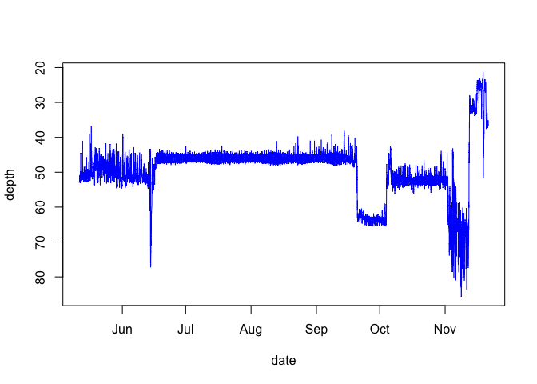
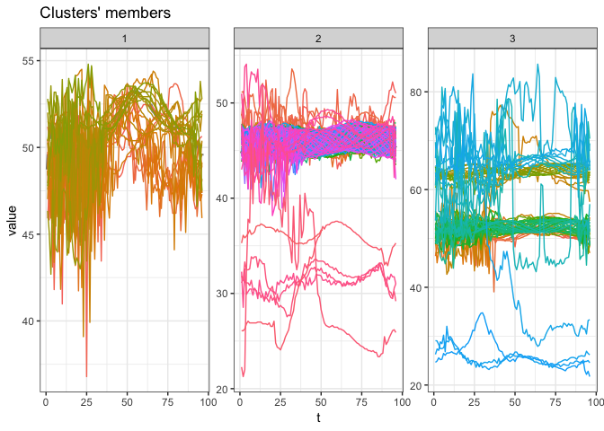
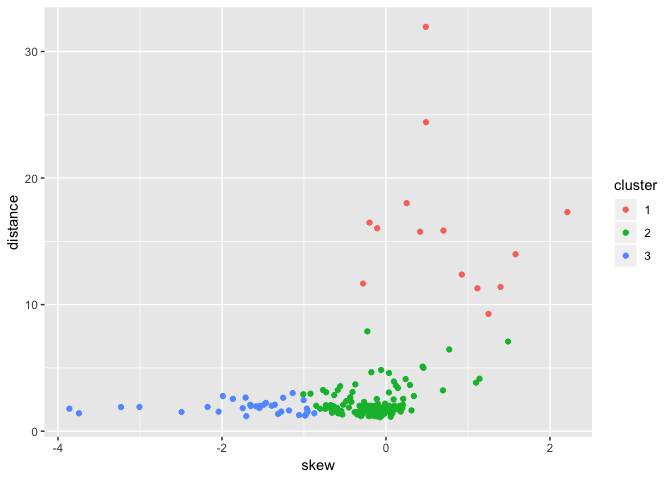
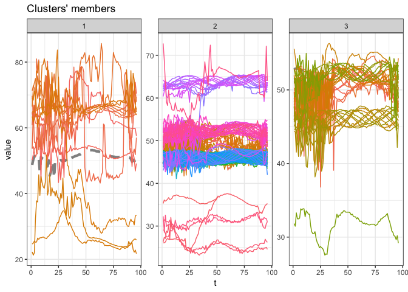

In this [R Markdown](http://rmarkdown.rstudio.com) Notebook I attempt to
use dynamic time warping and partitional clustering to assign one of the
three activity levels for daily time series data.

    library(R.matlab)

    ## R.matlab v3.6.1 (2016-10-19) successfully loaded. See ?R.matlab for help.

    ## 
    ## Attaching package: 'R.matlab'

    ## The following objects are masked from 'package:base':
    ## 
    ##     getOption, isOpen

    library(dtwclust)

    ## Loading required package: proxy

    ## 
    ## Attaching package: 'proxy'

    ## The following objects are masked from 'package:stats':
    ## 
    ##     as.dist, dist

    ## The following object is masked from 'package:base':
    ## 
    ##     as.matrix

    ## Loading required package: dtw

    ## Loaded dtw v1.20-1. See ?dtw for help, citation("dtw") for use in publication.

    ## dtwclust:
    ## Setting random number generator to L'Ecuyer-CMRG (see RNGkind()).
    ## To read the included vignettes type: browseVignettes("dtwclust").
    ## See news(package = "dtwclust") after package updates.

    library(ggplot2)

    # matlabFile  <- readMat('/Users/cliu/Dropbox/Geolocation/projects/Halibut/Maine Atlantic halibut analyses/preprocessing/processed_tags/10_raw.mat')
    matlabFile  <- readMat('/Users/cliu/Dropbox/Geolocation/projects/cod_zemeckis/tag_data/13_raw.mat')
    varNames    <- names(matlabFile$tag[,,1])
    tag     <- matlabFile$tag
    tag     <- lapply(tag, unlist, use.names=FALSE)
    names(tag) <- varNames

    source('matlab_time.R')
    df<-data.frame(date=matlab2POS(tag$dnum), depth=tag$depth)
    data <- split(df$depth, as.Date(df$date))
    plot(df,type="l",ylim = rev(range(tag[["depth"]])), col="blue")

Using DTW to cluster daily depth series
---------------------------------------

    pc <- tsclust(data, type = "partitional", k = 3L,
        distance = "dtw_basic", centroid = "pam",
        seed = 3247L, trace = TRUE,
        args = tsclust_args(dist = list(window.size = 10L)))

    ## 
    ##  Precomputing distance matrix...
    ## 
    ## Iteration 1: Changes / Distsum = 195 / 97032.9
    ## Iteration 2: Changes / Distsum = 18 / 80720.9
    ## Iteration 3: Changes / Distsum =  0 / 80720.9
    ## 
    ##  Elapsed time is 0.649 seconds.

    plot(pc)

    pc@cluster

    ##   [1] 3 3 1 3 3 3 1 1 2 1 1 2 1 1 1 1 2 1 1 1 3 1 3 1 1 3 3 1 1 1 1 1 3 3 3
    ##  [36] 3 2 2 2 2 2 2 2 2 2 2 2 2 2 2 2 2 2 2 2 2 2 2 2 2 2 2 2 2 2 2 2 2 2 2
    ##  [71] 2 2 2 2 2 2 2 2 2 2 2 2 2 2 2 2 2 2 2 2 2 2 2 2 2 2 2 2 2 2 2 2 2 2 2
    ## [106] 2 2 2 2 2 2 2 2 2 2 2 2 2 2 2 2 2 2 2 2 2 2 2 2 2 2 2 3 3 3 3 3 3 3 3
    ## [141] 3 3 3 3 3 3 3 2 1 3 3 3 3 3 3 3 3 3 3 3 1 3 3 1 1 3 3 3 3 3 3 3 3 3 3
    ## [176] 3 3 3 3 3 3 3 3 3 3 3 2 2 2 3 3 3 2 2 2

Clustering based on skew and distance, using k-means
----------------------------------------------------

    skew<-function(x) length(x)/((length(x)-1) * (length(x)-2)) * sum(( (x-mean(x))/sd(x) )^3 )
    distance<-function(x) abs(median(x)-max(x))
    skewlist=c()
    dlist=c()
    for (name in names(data)) {
      skewlist <- append(skewlist, skew(data[[name]]))
      dlist <- append(dlist, distance(data[[name]]))
    }
    metricdf <- data.frame(date=names(data), skew=skewlist, distance=dlist)

    fit.km <- kmeans(metricdf[2:3], 3, nstart=2)
    metricdf$cluster = as.character(fit.km$cluster)
    metricdf

    ##           date         skew distance cluster
    ## 1   2010-05-11  0.057921649  1.13765       2
    ## 2   2010-05-12 -1.582400633  1.96400       3
    ## 3   2010-05-13 -3.861456494  1.77760       3
    ## 4   2010-05-14 -0.095941769  1.54970       2
    ## 5   2010-05-15 -0.520987995  2.09355       2
    ## 6   2010-05-16 -3.743991930  1.41195       3
    ## 7   2010-05-17 -3.006301099  1.91650       3
    ## 8   2010-05-18 -0.588427598  3.24245       2
    ## 9   2010-05-19 -0.177811189  4.65580       2
    ## 10  2010-05-20  0.096734966  3.92745       2
    ## 11  2010-05-21 -0.059051312  4.83160       2
    ## 12  2010-05-22  0.121749359  3.60425       2
    ## 13  2010-05-23  0.292949714  3.64650       2
    ## 14  2010-05-24  0.037290541  4.59740       2
    ## 15  2010-05-25 -0.653175743  2.01195       2
    ## 16  2010-05-26 -0.920461962  2.95735       2
    ## 17  2010-05-27  0.446797274  5.10430       2
    ## 18  2010-05-28 -1.137834177  3.00830       3
    ## 19  2010-05-29 -0.728925448  3.07295       2
    ## 20  2010-05-30 -0.558532620  3.55295       2
    ## 21  2010-05-31 -1.253260318  2.64140       3
    ## 22  2010-06-01 -3.231876946  1.90160       3
    ## 23  2010-06-02 -1.008520522  2.91585       2
    ## 24  2010-06-03 -1.003979647  2.45705       3
    ## 25  2010-06-04 -1.355501973  2.09135       3
    ## 26  2010-06-05 -1.866468153  2.55240       3
    ## 27  2010-06-06 -2.175231703  1.91430       3
    ## 28  2010-06-07 -2.040653439  1.53920       3
    ## 29  2010-06-08 -1.654390075  2.08715       3
    ## 30  2010-06-09 -1.489412496  2.09560       3
    ## 31  2010-06-10 -1.542415968  1.82320       3
    ## 32  2010-06-11 -1.182093367  1.63775       3
    ## 33  2010-06-12 -0.066047654  1.86660       2
    ## 34  2010-06-13 -0.850797005  2.00535       2
    ## 35  2010-06-14 -0.106861430 16.03560       1
    ## 36  2010-06-15 -1.463518806  2.23310       3
    ## 37  2010-06-16  0.457220557  5.00330       2
    ## 38  2010-06-17 -0.009828748  2.17650       2
    ## 39  2010-06-18 -0.162420520  1.54790       2
    ## 40  2010-06-19 -0.078743942  1.59030       2
    ## 41  2010-06-20  0.003163715  1.72820       2
    ## 42  2010-06-21 -0.006558712  1.73450       2
    ## 43  2010-06-22 -0.044383563  1.77375       2
    ## 44  2010-06-23 -0.108335139  1.54580       2
    ## 45  2010-06-24 -0.109333086  1.82355       2
    ## 46  2010-06-25  0.060907036  1.77380       2
    ## 47  2010-06-26 -0.066897680  1.82570       2
    ## 48  2010-06-27 -0.019962162  1.59140       2
    ## 49  2010-06-28 -0.025166297  1.59455       2
    ## 50  2010-06-29 -0.049500076  1.45785       2
    ## 51  2010-06-30 -0.107946678  1.18105       2
    ## 52  2010-07-01 -0.382663346  1.50340       2
    ## 53  2010-07-02 -0.133479423  1.18540       2
    ## 54  2010-07-03 -0.303718246  1.18320       2
    ## 55  2010-07-04 -0.048033452  1.23415       2
    ## 56  2010-07-05  0.078745222  1.41115       2
    ## 57  2010-07-06  0.055865358  1.36450       2
    ## 58  2010-07-07 -0.033018212  1.36770       2
    ## 59  2010-07-08 -0.208553279  1.18530       2
    ## 60  2010-07-09 -0.113431758  1.27975       2
    ## 61  2010-07-10 -0.184130637  1.32210       2
    ## 62  2010-07-11 -0.216968423  1.58705       2
    ## 63  2010-07-12 -0.120125931  1.59245       2
    ## 64  2010-07-13  0.017094809  1.77690       2
    ## 65  2010-07-14 -0.174751854  1.64120       2
    ## 66  2010-07-15 -0.112436267  1.64120       2
    ## 67  2010-07-16 -0.114028778  1.73460       2
    ## 68  2010-07-17 -0.034887141  1.69120       2
    ## 69  2010-07-18 -0.141749402  1.99930       2
    ## 70  2010-07-19 -0.085777872  1.72350       2
    ## 71  2010-07-20 -0.036122750  1.68900       2
    ## 72  2010-07-21  0.169073334  1.99930       2
    ## 73  2010-07-22  0.029133046  1.86030       2
    ## 74  2010-07-23 -0.120922653  1.41105       2
    ## 75  2010-07-24 -0.008015039  1.68235       2
    ## 76  2010-07-25 -0.057985560  1.45890       2
    ## 77  2010-07-26 -0.127244856  1.49545       2
    ## 78  2010-07-27 -0.175189216  1.55010       2
    ## 79  2010-07-28 -0.107514956  1.55115       2
    ## 80  2010-07-29 -0.109856705  1.64455       2
    ## 81  2010-07-30 -0.023701988  1.41445       2
    ## 82  2010-07-31 -0.203966714  1.27650       2
    ## 83  2010-08-01 -0.098409165  1.45890       2
    ## 84  2010-08-02 -0.050624909  1.32430       2
    ## 85  2010-08-03 -0.095016307  1.32215       2
    ## 86  2010-08-04 -0.332978518  1.33220       2
    ## 87  2010-08-05  0.179864003  1.55240       2
    ## 88  2010-08-06 -0.133176821  1.49990       2
    ## 89  2010-08-07 -0.272713108  1.63900       2
    ## 90  2010-08-08 -0.189017512  1.45210       2
    ## 91  2010-08-09 -0.147552938  1.86470       2
    ## 92  2010-08-10 -0.094031608  1.95585       2
    ## 93  2010-08-11  0.040383179  2.00370       2
    ## 94  2010-08-12 -0.011204419  1.91245       2
    ## 95  2010-08-13 -0.592144013  1.81790       2
    ## 96  2010-08-14 -0.210662723  1.63895       2
    ## 97  2010-08-15 -0.103380009  1.64130       2
    ## 98  2010-08-16  0.061801295  1.77350       2
    ## 99  2010-08-17 -0.015138957  1.45320       2
    ## 100 2010-08-18  0.013602304  1.64125       2
    ## 101 2010-08-19 -0.281534392  1.35975       2
    ## 102 2010-08-20 -0.058775440  1.36550       2
    ## 103 2010-08-21 -0.657458627  1.45440       2
    ## 104 2010-08-22 -0.975406001  1.32095       3
    ## 105 2010-08-23 -1.539285428  1.95695       3
    ## 106 2010-08-24 -0.172948095  1.24470       2
    ## 107 2010-08-25 -0.026756531  1.68870       2
    ## 108 2010-08-26  0.062892937  1.71410       2
    ## 109 2010-08-27  0.075593616  1.57845       2
    ## 110 2010-08-28 -1.059276743  1.26740       3
    ## 111 2010-08-29 -1.315908184  1.36310       3
    ## 112 2010-08-30 -0.350801868  1.32095       2
    ## 113 2010-08-31 -1.703367133  1.18540       3
    ## 114 2010-09-01 -0.531782710  1.31865       2
    ## 115 2010-09-02 -0.579793343  1.40410       2
    ## 116 2010-09-03 -1.276408012  1.54540       3
    ## 117 2010-09-04 -0.350585028  1.49530       2
    ## 118 2010-09-05 -0.161513476  1.56155       2
    ## 119 2010-09-06 -0.740153700  1.76420       2
    ## 120 2010-09-07 -0.018727912  1.77570       2
    ## 121 2010-09-08 -1.546884002  1.86690       3
    ## 122 2010-09-09 -0.322032984  2.00705       2
    ## 123 2010-09-10  0.340624493  2.77410       2
    ## 124 2010-09-11 -0.280014587  1.73240       2
    ## 125 2010-09-12  0.022888105  1.90560       2
    ## 126 2010-09-13  0.005169731  1.91705       2
    ## 127 2010-09-14 -1.648387053  1.99565       3
    ## 128 2010-09-15 -0.040673319  1.60250       2
    ## 129 2010-09-16 -2.493025381  1.51255       3
    ## 130 2010-09-17 -0.873682162  1.41555       3
    ## 131 2010-09-18 -0.671029351  1.77215       2
    ## 132 2010-09-19 -1.746705910  1.81895       3
    ## 133 2010-09-20 -0.802648967  1.77455       2
    ## 134 2010-09-21  0.207707590  2.09580       2
    ## 135 2010-09-22 -0.223901560  2.00700       2
    ## 136 2010-09-23 -0.095925107  2.14255       2
    ## 137 2010-09-24  0.133914094  1.84730       2
    ## 138 2010-09-25  0.184418720  1.72785       2
    ## 139 2010-09-26 -0.021417293  1.36220       2
    ## 140 2010-09-27 -0.070585287  1.23010       2
    ## 141 2010-09-28  0.123025580  1.73130       2
    ## 142 2010-09-29  0.311654175  1.64020       2
    ## 143 2010-09-30 -0.004645211  1.50350       2
    ## 144 2010-10-01  0.200125804  1.82010       2
    ## 145 2010-10-02 -0.277598387  1.91350       2
    ## 146 2010-10-03 -0.732653166  2.05025       2
    ## 147 2010-10-04  1.114957780 11.28825       1
    ## 148 2010-10-05  0.771998967  6.45425       2
    ## 149 2010-10-06 -0.767450370  3.25160       2
    ## 150 2010-10-07  0.145676715  3.41180       2
    ## 151 2010-10-08  0.240128587  4.11805       2
    ## 152 2010-10-09 -0.266997209  2.31420       2
    ## 153 2010-10-10  0.035792077  3.05860       2
    ## 154 2010-10-11 -0.484641856  2.37335       2
    ## 155 2010-10-12 -0.421514314  2.31990       2
    ## 156 2010-10-13 -0.955324912  1.55870       3
    ## 157 2010-10-14 -0.627946835  1.92825       2
    ## 158 2010-10-15 -0.631071769  2.84640       2
    ## 159 2010-10-16  0.694965892  3.21915       2
    ## 160 2010-10-17  1.098910793  3.83300       2
    ## 161 2010-10-18 -0.676298736  2.05545       2
    ## 162 2010-10-19 -0.111940667  2.53995       2
    ## 163 2010-10-20  0.103581333  2.01215       2
    ## 164 2010-10-21 -1.536928245  1.99980       3
    ## 165 2010-10-22 -0.435801956  2.68000       2
    ## 166 2010-10-23 -0.311868121  1.66170       2
    ## 167 2010-10-24  0.093446478  2.50590       2
    ## 168 2010-10-25 -0.407573410  3.09010       2
    ## 169 2010-10-26 -0.544636686  1.60300       2
    ## 170 2010-10-27 -0.636800669  1.57715       2
    ## 171 2010-10-28 -0.986643979  1.23055       3
    ## 172 2010-10-29  0.209877246  2.55340       2
    ## 173 2010-10-30 -1.711864600  2.65025       3
    ## 174 2010-10-31 -1.392713657  2.01070       3
    ## 175 2010-11-01 -1.989009775  2.77185       3
    ## 176 2010-11-02 -0.279460758 11.66585       1
    ## 177 2010-11-03 -0.227061017  7.88520       2
    ## 178 2010-11-04  0.252810792 18.01475       1
    ## 179 2010-11-05 -0.200171274 16.48110       1
    ## 180 2010-11-06  0.701513533 15.84980       1
    ## 181 2010-11-07  0.924950951 12.37670       1
    ## 182 2010-11-08  0.416867643 15.75975       1
    ## 183 2010-11-09  1.397658558 11.39735       1
    ## 184 2010-11-10  1.580756177 13.98200       1
    ## 185 2010-11-11  2.212682824 17.31045       1
    ## 186 2010-11-12  0.485733161 31.94905       1
    ## 187 2010-11-13 -0.452000420  1.87095       2
    ## 188 2010-11-14 -0.188081265  2.01240       2
    ## 189 2010-11-15 -0.965597578  1.78180       3
    ## 190 2010-11-16  1.140548028  4.14305       2
    ## 191 2010-11-17  1.489319728  7.08180       2
    ## 192 2010-11-18  1.250418372  9.26740       1
    ## 193 2010-11-19  0.488104997 24.41450       1
    ## 194 2010-11-20 -0.373679370  3.69635       2
    ## 195 2010-11-21 -0.072895594  1.09480       2

    ggplot(data = metricdf, aes(x=skew, y=distance)) + 
                 geom_point(aes(colour=cluster))

    pc1=pc
    pc1@cluster=fit.km$cluster
    plot(pc1)

    fit.km$cluster

    ##   [1] 2 3 3 2 2 3 3 2 2 2 2 2 2 2 2 2 2 3 2 2 3 3 2 3 3 3 3 3 3 3 3 3 2 2 1
    ##  [36] 3 2 2 2 2 2 2 2 2 2 2 2 2 2 2 2 2 2 2 2 2 2 2 2 2 2 2 2 2 2 2 2 2 2 2
    ##  [71] 2 2 2 2 2 2 2 2 2 2 2 2 2 2 2 2 2 2 2 2 2 2 2 2 2 2 2 2 2 2 2 2 2 3 3
    ## [106] 2 2 2 2 3 3 2 3 2 2 3 2 2 2 2 3 2 2 2 2 2 3 2 3 3 2 3 2 2 2 2 2 2 2 2
    ## [141] 2 2 2 2 2 2 1 2 2 2 2 2 2 2 2 3 2 2 2 2 2 2 2 3 2 2 2 2 2 2 3 2 3 3 3
    ## [176] 1 2 1 1 1 1 1 1 1 1 1 2 2 3 2 2 1 1 2 2
