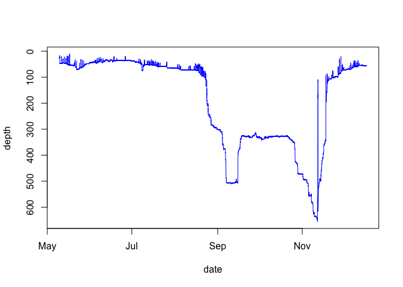
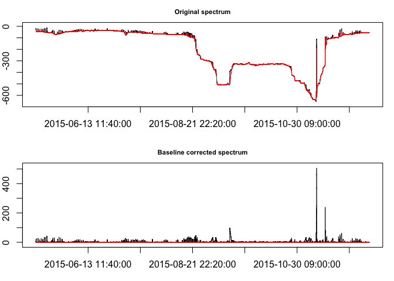
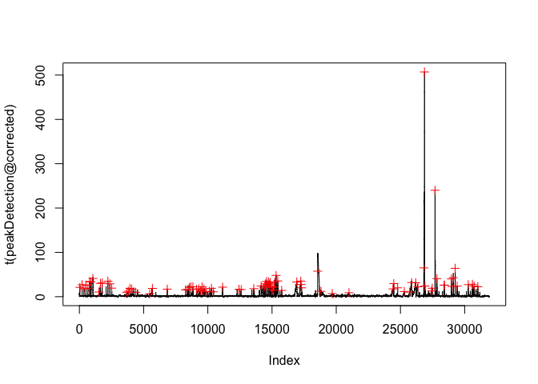
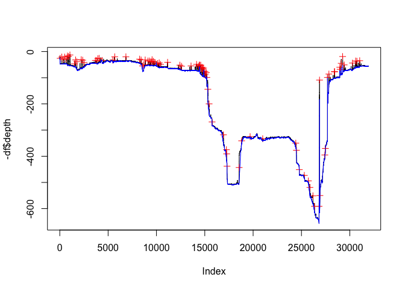
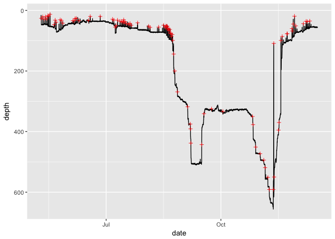

Detection of off-bottom movements from Monkfish DST data
================

Extensive vertical movements of monkfish can be recorded by the data storage tags (DSTs). Such behavior may be related to spawning, foraging, or tidal-based migration behavior. In this notebook I explore a method to detect off-bottom movements from monkfish DST data. I first remove the baseline from the depth timeseries data and then detect peaks in the corrected signal.

``` r
library(R.matlab)
```

    ## R.matlab v3.6.1 (2016-10-19) successfully loaded. See ?R.matlab for help.

    ## 
    ## Attaching package: 'R.matlab'

    ## The following objects are masked from 'package:base':
    ## 
    ##     getOption, isOpen

``` r
library('baseline')
```

    ## 
    ## Attaching package: 'baseline'

    ## The following object is masked from 'package:stats':
    ## 
    ##     getCall

``` r
library("wmtsa")
library(ggplot2)
source('matlab_time.R')
```

Read the preprocessed tag data:

``` r
matlabFile  <- readMat('/Users/cliu/Dropbox/Geolocation/projects/monkfish/Preprocessing/processed_tags/10_raw.mat')
varNames    <- names(matlabFile$tag[,,1])
tag     <- matlabFile$tag
tag     <- lapply(tag, unlist, use.names=FALSE)
names(tag) <- varNames
```

Plot the depth timeseries:

``` r
df<-data.frame(date=matlab2POS(tag$dnum), depth=tag$depth)
data <- split(df$depth, as.Date(df$date))
plot(df,type="l",ylim = rev(range(tag[["depth"]])), col="blue")
```



Use the `baseline` package to detece the baseline signal, and correct the signal (substracting the baseline from the original signal):

``` r
peakDetection <- baseline(t(-df$depth), method = "peakDetection", left=36, lwin=5)
plot(peakDetection, labels=df$date)
```



Use the `wmtsa` package to detect peaks in the corrected signal:

``` r
x = wavCWT(t(peakDetection@corrected))
xtree = wavCWTTree(x)
P = wavCWTPeaks(xtree, noise.min=7, noise.span=36)
plot(t(peakDetection@corrected), type="l")
points(P$x, P$y,pch=3,col="red")
```



``` r
plot(-df$depth, type="l")
points(P$x, -df$depth[P$x],pch=3,col="red")
lines(t(peakDetection@baseline), type="l", col="blue")
```



``` r
Pdf = data.frame(x=df$date[P$x], y=df$depth[P$x])
ggplot(data=df, aes(x=date, y=depth)) +geom_line() +geom_point(data=Pdf, aes(x=x, y=y), shape=3, color="red") +scale_y_reverse() 
```



Output the detected off-bottom movement events into a dataframe:

``` r
df_offbottom <- df[P$x,]
rownames(df_offbottom) <- 1:nrow(df_offbottom)
df_offbottom
```

    ##                   date depth
    ## 1  2015-05-10 01:10:00    26
    ## 2  2015-05-11 05:10:00    21
    ## 3  2015-05-12 05:10:00    29
    ## 4  2015-05-13 07:30:00    21
    ## 5  2015-05-14 08:10:00    28
    ## 6  2015-05-15 07:30:00    17
    ## 7  2015-05-16 01:20:00    19
    ## 8  2015-05-17 01:20:00    13
    ## 9  2015-05-20 07:00:00    47
    ## 10 2015-05-21 03:50:00    32
    ## 11 2015-05-22 01:40:00    39
    ## 12 2015-05-25 04:20:00    31
    ## 13 2015-05-26 05:30:00    33
    ## 14 2015-05-27 04:50:00    42
    ## 15 2015-06-04 08:20:00    34
    ## 16 2015-06-05 05:20:00    34
    ## 17 2015-06-06 02:40:00    27
    ## 18 2015-06-07 01:50:00    26
    ## 19 2015-06-09 05:30:00    34
    ## 20 2015-06-16 19:40:00    33
    ## 21 2015-06-18 05:50:00    20
    ## 22 2015-06-26 06:20:00    20
    ## 23 2015-07-06 02:40:00    29
    ## 24 2015-07-07 03:50:00    32
    ## 25 2015-07-08 06:30:00    55
    ## 26 2015-07-09 02:00:00    50
    ## 27 2015-07-10 03:00:00    32
    ## 28 2015-07-12 02:30:00    36
    ## 29 2015-07-13 06:50:00    36
    ## 30 2015-07-14 07:40:00    39
    ## 31 2015-07-15 01:40:00    31
    ## 32 2015-07-15 04:30:00    38
    ## 33 2015-07-16 02:00:00    37
    ## 34 2015-07-17 02:30:00    43
    ## 35 2015-07-19 01:20:00    46
    ## 36 2015-07-20 04:10:00    43
    ## 37 2015-07-21 03:30:00    49
    ## 38 2015-07-26 05:30:00    41
    ## 39 2015-08-04 01:10:00    52
    ## 40 2015-08-05 05:50:00    56
    ## 41 2015-08-12 01:20:00    55
    ## 42 2015-08-16 00:50:00    49
    ## 43 2015-08-17 08:20:00    56
    ## 44 2015-08-18 01:00:00    51
    ## 45 2015-08-18 08:20:00    53
    ## 46 2015-08-19 00:40:00    52
    ## 47 2015-08-19 07:40:00    62
    ## 48 2015-08-20 01:10:00    60
    ## 49 2015-08-20 08:30:00    67
    ## 50 2015-08-21 01:00:00    63
    ## 51 2015-08-21 08:20:00    75
    ## 52 2015-08-22 00:40:00    76
    ## 53 2015-08-22 08:20:00    86
    ## 54 2015-08-23 00:20:00    80
    ## 55 2015-08-23 09:00:00    99
    ## 56 2015-08-24 03:20:00   144
    ## 57 2015-08-25 00:30:00   200
    ## 58 2015-08-27 03:50:00   269
    ## 59 2015-09-04 07:50:00   318
    ## 60 2015-09-06 11:10:00   375
    ## 61 2015-09-06 15:20:00   391
    ## 62 2015-09-06 21:40:00   438
    ## 63 2015-09-15 14:10:00   443
    ## 64 2015-09-17 09:50:00   341
    ## 65 2015-09-23 11:50:00   325
    ## 66 2015-10-02 13:00:00   333
    ## 67 2015-10-26 07:10:00   350
    ## 68 2015-10-26 18:20:00   377
    ## 69 2015-10-28 20:10:00   451
    ## 70 2015-11-01 10:20:00   473
    ## 71 2015-11-04 08:30:00   494
    ## 72 2015-11-05 10:40:00   519
    ## 73 2015-11-07 15:00:00   551
    ## 74 2015-11-08 18:40:00   591
    ## 75 2015-11-12 00:20:00   591
    ## 76 2015-11-12 08:30:00   109
    ## 77 2015-11-12 15:20:00   550
    ## 78 2015-11-16 03:50:00   395
    ## 79 2015-11-16 13:20:00   370
    ## 80 2015-11-18 01:30:00    99
    ## 81 2015-11-19 02:20:00    86
    ## 82 2015-11-23 00:40:00    77
    ## 83 2015-11-23 04:20:00    77
    ## 84 2015-11-26 22:20:00    60
    ## 85 2015-11-27 04:10:00    68
    ## 86 2015-11-27 22:30:00    45
    ## 87 2015-11-28 22:30:00    19
    ## 88 2015-11-30 01:00:00    51
    ## 89 2015-12-06 01:00:00    44
    ## 90 2015-12-08 07:10:00    36
    ## 91 2015-12-09 05:00:00    37
    ## 92 2015-12-11 05:00:00    35
